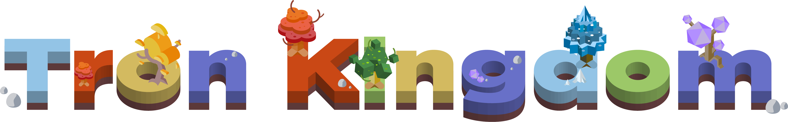

# Tron Kingdom: The first on-chain strategy game on Tron blockchain

- [English Manual](https://github.com/block-kingdom/TronKingdom-docs/issues/2)
- [简体中文游戏手册](https://github.com/block-kingdom/TronKingdom-docs/issues/1)

Tron Kingdom is a strategic game inspired by board game Diplomacy. A player in Tron Kingdom will represent a fantasy kingdom and chat with other kingdoms, trying to conquer all the lands on the continent by alliance or betrayal. Powered by the Tron blockchain, fair play and benefit of winner is ensured.

